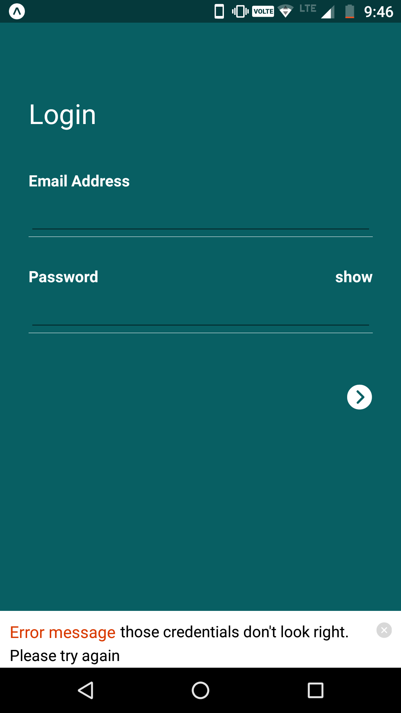

## React-native app

<table>
	<tr>
		<td></td>
    <td></td>
    <td></td>
    <td></td>
 

<tr>

</table>
## How to use
- Clone
- Run npm install in the terminal
- For Expo
- npm install -g expo-cli
- expo start

## Dependencies
- react
- react-native
- react-native-vector-icons

## Contributions
- any help in errors will be highly appreciated.

